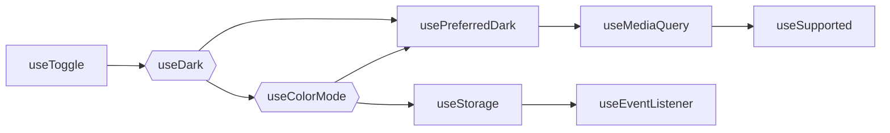

# 可组合的 Vue

编写可组合可复用的 Vue 函数

<div class="abs-br !mx-14 my-12">
  <div class="mb-3">
  贺晋飞
  </div>
</div>


---
layout: center
class: text-center
---

# Composable

组合式


---

# React Hooks

React 16.8 提供的新特性，为函数组件提供状态、生命周期等。  
使得组件自身能够通过某种机制再触发状态的变更并且引起 re-render。

```ts {all|5|9,10}
import React, { useState } from 'react';

function Example() {
  // 声明一个叫 "count" 的 state 变量
  const [count, setCount] = useState(0);

  return (
    <div>
      <p>You clicked {count} times</p>
      <button onClick={() => setCount(count + 1)}>Click me</button>
    </div>
  );
}
```


---

# React Hooks

&nbsp;

- 过去几年中，发生的最大的一个开发范式层面的一个变化

- 已经彻底取代了 Class 组件。

- 启发了很多组件逻辑表达和逻辑复用的新范式：

<div class="flex justify-evenly mt-10">

Vue

Svelte

SolidJS

</div>


---

# 什么是组合式 API ？

Vue 3 中引入的一种新的编写 Vue 的方式。

<div class="grid grid-cols-2 gap-x-4">

<div>

```html {all|3-4|5-6|7-10|14-15}
<script setup lang="ts">
import { ref, watchEffect } from 'vue'
// 状态
const count = ref(0)
// 副作用
watchEffect(() => console.log(count.value))
function addCount() {
  // 状态更新
  count.value++
}
</script>

<template>
  <p>你点击了 {{ count }} 次</p>
  <button @click="addCount()">点击</button>
</template>
```

<DemoFirst />

</div>

- 基于依赖追踪的范式

- 一次调用，符合原生 JS 直觉

- 自动追踪依赖，无需手动声明


</div>


---
clicks: 4
---

# 对象式 API 与 组合式 API

<div class="grid grid-cols-2 gap-x-4">

```html {all|3,7,8,12,13,17|4-6|8-12|13-17} {at:0}
<script>
export default {
  data() {
    return {
      dark: false
    }
  },
  computed: {
    light() {
      return !this.dark
    }
  },
  methods: {
    toggleDark() {
      this.dark = !this.dark
    }
  }
}
</script>
```

```html {all|1|4|5|7-9} {at:0}
<script setup>
import { ref, computed } from 'vue'

const dark = ref(false)
const light = computed(() => !dark.value)

function toggleDark() {
  dark.value = !dark.value
}
</script>
```

</div>


---

# 什么是组合式函数 ？

利用 Vue 组合式 API 来封装和复用有状态逻辑的函数。

<v-click>

**无状态逻辑**：接收一些输入后立刻返回所期望的输出。

```ts
let list = [0, 1, 2, 3, 4]
let result = list.map(i => i * 2)
list.pop()
result = list.map(i => i * 2)
```

</v-click>

<v-click>

**有状态逻辑**：管理会随时间而变化的状态。

```ts
import { useArrayMap } from '@vueuse/core'
const list = ref([0, 1, 2, 3, 4])
const result = useArrayMap(list, i => i * 2)
// result.value: [0, 2, 4, 6, 8]
list.value.pop()
// result.value: [0, 2, 4, 6]
```

</v-click>


---
clicks: 2
---

# Mixin 与 组合式函数

复用

<div class="grid grid-rows-2 grid-cols-2 gap-x-4">

```js {all|4,8,9,10|0} {at:0}
export default {
  data() {
    return {
      dark: false
    }
  },
  methods: {
    toggleDark() {
      this.dark = !this.dark
    }
  }
}
```

```js {all|3-7|0} {at:0}
import { ref } from 'vue'
export function useMouse() {
  const dark = ref(false)
  function toggleDark() {
    dark.value = !dark.value
  }
  return { dark, toggleDark }
}
```

```html {all|0|4} {at:0}
<script>
import myMixin from './myMixin.js'
export default {
  mixins: [myMixin]
}
</script>
```

```html {all|0|2-4} {at:0}
<script setup>
import { useMouse } from './dark.js'

const { dark, toggleDark } = useMouse()
</script>
```

</div>

---
clicks: 3
---

# Mixin 与 组合式函数

&nbsp;

<v-click>

- 不清晰的 property 来源  
使用多个 mixin ，property 来自哪个 mixin 变得不清晰。追溯实现和理解组件行为变得困难。

    > 使用 ref + 解构模式，property 的来源在消费组件时一目了然。

</v-click>

<div class="mt-10"></div>

<v-click>

- 命名空间冲突  
多个来自不同作者的 mixin 可能会注册相同的 property 键名。

    > 在解构变量时可以对变量进行重命名。

</v-click>

<div class="mt-10"></div>

<v-click>

- 隐式的跨 mixin 交流  
多个 mixin 需要依赖共享的 property 键名来进行相互作用，这使得它们隐性地耦合在一起。

    > 一个组合式函数的返回值可以作为另一个组合式函数的参数被传入，像普通函数那样。

</v-click>


---
clicks: 6
---

# 总结

<div class="grid grid-cols-2 gap-x-4 gap-y-4">

###### 对象式 存在的问题

###### 组合式 提供的能力

<v-clicks at="1">

- 上下文丢失
- 有限的类型支持
- 按 API 类型组织
- 不利于复用
- mixin 潜在命名冲突

</v-clicks>

<v-clicks at="1">

- 提供更好的上下文支持
- 更好的 TypeScript 类型支持
- 按功能/逻辑组织
- 极易复用 (原生 JS 函数)
- 可灵活组合 (生命周期钩子可多次使用)
- 可独立于 Vue 组件使用

</v-clicks>

</div>


---

# VueUse 是什么

Vue 组合式 API 工具包

<div class="mt-10 mb-10">
  <a class="!border-none" href="https://www.npmjs.com/package/@vueuse/core" target="__blank"></a>
  <a class="!border-none" href="https://www.npmjs.com/package/@vueuse/core" target="__blank"></a>
  
  <br>
</div>


  - 200+ 组合式函数
  - 同时兼容 Vue 2 和 Vue 3
  - Tree-shakeable
  - TypeScript
  - 丰富的扩展包，如 Router、Electron、RxJS
  - CDN 兼容
  - SSR 友好
  - 文档自带交互性演示


---
layout: center
class: text-center
---

# 实现一个 useMouse


---

# 命名

&nbsp;

约定用驼峰命名法命名，以 `use` 开头，如

- useLastChanged
- useLocalStorage
- useElementVisibility
- useWindowSize
- useDark
- useTitle
- useArrayMap
- useMouse


---

<div class="grid grid-cols-2 gap-x-4"><div>

# Ref

```ts
import { ref } from 'vue'
let foo = 0
let bar = ref(0)
foo = 1
bar = 1 // ts-error
```

<div class="mt-4" v-click>

###### 优点

- 显式调用，类型检查
- 相比 Reactive 局限更少

###### 缺点

- `.value`

</div>

</div><div>

# Reactive

```ts
import { reactive } from 'vue'
const foo = { prop: 0 }
const bar = reactive({ prop: 0 })
foo.prop = 1
bar.prop = 1
```

<div class="mt-4" v-click>

###### 优点

- 自动 Unwrap (即不需要 `.value`)

###### 缺点

- 在类型上和一般对象没有区别
- 使用 ES6 解构会使响应性丢失
- 需要使用箭头函数包装才能使用 `watch`

</div>
</div></div>

---

# 返回由 Ref 组成的对象 <MarkerPattern />

以在使用可组合的函数式，同时获得 `ref` 和 `reactive` 的好处。

<div class="mt-1" />
<div class="grid grid-cols-2 gap-x-4">
<v-clicks>

```ts
import { ref, reactive } from 'vue'
function useMouse() {
  const x = ref(0)
  const y = ref(0)
  return { x, y }
}
const { x, y } = useMouse()
const mouse = reactive(useMouse())
mouse.x === x.value // true
```

<div class="px-2 py-4">

- 可以直接使用 ES6 解构其中的 Ref 使用
- 根据使用方式，当想要自动解包的功能时，可以使用 `reactive` 将其转换为对象

</div>

</v-clicks>
</div>


---

# useMouse 简易实现

```ts
// mouse.js
import { ref, onMounted, onUnmounted } from 'vue'

export function useMouse() {      // 按照惯例，组合式函数名以 use 开头
  const x = ref(0)                // 被组合式函数封装和管理的状态
  const y = ref(0)

  function update(event) {         // 组合式函数可以随时更改其状态
    x.value = event.pageX
    y.value = event.pageY
  }
  // 一个组合式函数也可以挂靠在所属组件的生命周期上，来启动和卸载副作用
  onMounted(() => window.addEventListener('mousemove', update))
  onUnmounted(() => window.removeEventListener('mousemove', update))

  return { x, y }         // 通过返回值暴露所管理的状态
}
```


---

# 改进 - 副作用自动清除 <MarkerPattern />

一个组合式函数可以调用其他的组合式函数

```ts
// event.js
import { onMounted, onUnmounted } from 'vue'
export function useEventListener(target, event, callback) {
  onMounted(() => target.addEventListener(event, callback))
  onUnmounted(() => target.removeEventListener(event, callback))
}
```
```ts
// mouse.js
import { ref } from 'vue'
import { useEventListener } from './event'
export function useMouse() {
  const x = ref(0)
  const y = ref(0)
  useEventListener(window, 'mousemove', (event) => {
    x.value = event.pageX
    y.value = event.pageY
  })

  return { x, y }
}
```


---

# 使用

```html
<script setup>
import { useMouse } from './mouse.js'

const { x, y } = useMouse()
</script>

<template>鼠标的位置在 {{ x }}, {{ y }}</template>
```

<DemoMouse />


---

# 改进 - 节流防抖 <MarkerPattern />

```ts {maxHeight:'100'}
export function debounceFilter(ms: number) {
  let timer
  const filter = (invoke) => {
    const duration = unref(ms)
    if (timer) clearTimeout(timer)
    if (duration <= 0) { return invoke() }
    timer = setTimeout(() => { invoke() }, duration)
  }
  return filter
}
export function useMouse(options: useMouseOption = {}) {
  const { eventFilter } = options
  const mouseHandler = (event: MouseEvent) => {
    x.value = event.pageX
    y.value = event.pageY
  }
  const mouseHandlerWrapper = (event: MouseEvent) => {
    return eventFilter === undefined ? mouseHandler(event) : eventFilter(() => mouseHandler(event))
  }
  useEventListener(window, 'mousemove', mouseHandlerWrapper)
  return { x, y }
}
```


---

# 使用

```html
<script setup>
import { useMouse } from './mouse2.js'
import { debounceFilter } from './filter.js'

const { x, y } = useMouse({ eventFilter: debounceFilter(200) })
</script>

<template>鼠标的位置在 {{ x }}, {{ y }}</template>
```

<DemoMouse2 />


---

<DemoMouse3 />


---
layout: center
class: text-center
---

# 实现一个 useTitle


---

# Ref 自动解包 <MarkerCore />

在众多情况下，我们可以减少 `.value` 的使用

<div class="grid grid-cols-[320px,1fr] gap-x-4 gap-y-2 pt-4">

<v-clicks :every='2'>

- `watch` 直接接受 Ref 作为监听对象，并在回调函数中返回解包后的值

```ts
const counter = ref(0)
watch(counter, count => {
  console.log(count) // 同 `counter.value`
})
```

- Ref 在模版中自动解包

```html
<template>
  <button @click="counter += 1">
    Counter is {{ counter }}
  </button>
</template>
```

- 使用 Reactive 解包嵌套的 Ref

<div>

```ts
import { ref, reactive } from 'vue'
const foo = ref('bar')
const data = reactive({ foo, id: 10 })
data.foo // 'bar'
```

</div>

</v-clicks>

</div>

---

# 重复使用已有 Ref <MarkerCore />

如果将一个 `ref` 传递给 `ref()` 构造函数，它将会原样将其返回。

<v-clicks>

```ts
const foo = ref(1)   // Ref<1>
const bar = ref(foo) // Ref<1>

foo === bar // true
```

```ts
function useFoo(foo: Ref<string> | string) {
  const bar = isRef(foo) ? foo : ref(foo)
  // 等效于
  const bar = ref(foo)
}
```

这个技巧在编写不确定参数类型的函数时十分有用。

</v-clicks>

---

# `unref` - Ref 的反操作 <MarkerCore />

- 如果传入一个 Ref ，返回其值
- 否则原样返回

<div class="grid grid-cols-2 gap-x-4 mt-4">

<div v-click>

###### 实现

```ts
function unref<T>(r: Ref<T> | T): T {
  return isRef(r) ? r.value : r
}
```

</div><div v-click>

###### 使用

```ts
import { unref, ref } from 'vue'
const foo = ref('foo')
unref(foo) // 'foo'
const bar = 'bar'
unref(bar) // 'bar'
```

</div></div>

---

# 接受 Ref 作为函数参数 <MarkerPattern />

<div class="grid grid-cols-[160px,1fr,220px] gap-x-4">

<div />

###### 实现

###### 用例

<v-clicks :every='3'>

<div class="my-auto leading-6 text-base opacity-75">
纯函数
</div>


```ts
function add(a: number, b: number) {
  return a + b
}
```

```ts
let a = 1
let b = 2
let c = add(a, b) // 3
```

<div class="my-auto leading-6 text-base opacity-75">
接受 Ref 作为参数，<br>
返回一个响应式的结果
</div>

```ts
function add(a: Ref<number>, b: Ref<number>) {
  return computed(() => a.value + b.value)
}
```

```ts
const a = ref(1)
const b = ref(2)
const c = add(a, b)
c.value // 3
```

<div class="my-auto leading-6 text-base opacity-75">
同时接受传入值和 Ref
</div>

```ts
function add(
  a: Ref<number> | number,
  b: Ref<number> | number
) {
  return computed(() => unref(a) + unref(b))
}
```

```ts
const a = ref(1)
const c = add(a, 5)
c.value // 6
```

</v-clicks>

</div>

---

# MaybeRef 类型工具 <MarkerTips/>

```ts
type MaybeRef<T> = Ref<T> | T
```

可选择性的响应式参数。

```ts
import { computed, unref, Ref } from 'vue'
type MaybeRef<T> = Ref<T> | T
export function useTimeAgo(
  // time: Date | number | string | Ref<Date | number | string>,
  time: MaybeRef<Date | number | string>,
) {
  return computed(() => someFormating(unref(time)))
}
```

---

# 小结

<div v-click>

- `MaybeRef<T>` 可以很好的配合 `ref` 和 `unref` 进行使用。
- 使用 `ref()` 当你想要想要将其标准化为 Ref
- 使用 `unref()` 当你想要获得其值

<br>

```ts
type MaybeRef<T> = Ref<T> | T
function useBala<T>(arg: MaybeRef<T>) {
  const reference = ref(arg) // 得到 ref
  const value = unref(arg)   // 得到值
}
```

</div>


---

# useTitle 简易实现

<div class="grid grid-cols-[450px,1fr] gap-4">


```ts
import { ref, watch } from 'vue'
type MaybeRef<T> = Ref<T> | T

export function useTitle(
  newTitle: MaybeRef<string | null | undefined>
) {
  const title = ref(newTitle || document.title)

  watch(title, (t) => {
    if (t != null)
      document.title = t
  }, { immediate: true })

  return title
}
```

<v-click>

```html


<-- 1. 重复使用用户提供的 Ref, 或者建立一个新的

<-- 2. 将页面标题与 Ref 进行同步


```

</v-click>
</div>


---

# useTitle 使用

```html
<script setup lang="ts">
import { useTitle } from './useTitle'
const title = useTitle(null)
</script>

<template>
  <span class="mr-5">修改title：</span>
  <input class="mt-10 border" v-model="title" type="text">
</template>
```

<DemoTitle />


---
layout: center
class: text-center
---

# 实现一个 useDark


---

# 为更好的代码组织抽取组合式函数 <MarkerPattern />

&nbsp;

抽取组合式函数不仅是为了复用，也是为了代码组织。  
随着组件复杂度的增高，可能会最终发现组件多得难以查询和理解。

通过组合式，可以基于逻辑问题将组件代码拆分成更小的函数：

```html
<script setup>
import { useFeatureA } from './featureA.js'
import { useFeatureB } from './featureB.js'
import { useFeatureC } from './featureC.js'

const { foo, bar } = useFeatureA()
const { baz } = useFeatureB(foo)
const { qux } = useFeatureC(baz)
</script>
```


---

# 简易实现

```ts {all|3,4|all}
import { usePreferredDark, useColorMode } from '@vueuse/core'
export function useDark() {
  const preferredDark = usePreferredDark()
  const mode = useColorMode()

  return computed<boolean>({
    get() {
      return mode.value === 'dark'
    },
    set(v) {
      if (v === preferredDark.value)
        mode.value = 'auto'
      else
        mode.value = v ? 'dark' : 'light'
    }
  })
}
```


---

# 使用

```html {all|3,6|all}
<script setup lang="ts">
import { useDark } from './useDark.ts'
import { useToggle } from '@vueuse/core'

const isDark = useDark()
const toggleDark = useToggle(isDark)
</script>
<template>
  <button
    @click="toggleDark()">
    <carbon:moon v-if="isDark" />
    <carbon:sun v-else />

    <span class="mr-1 ml-2">{{ isDark ? 'Dark' : 'Light' }}</span>
  </button>
</template>
```

<DemoDark />


---

# 组合关系

&nbsp;



<div class="mt-10">

- 其中每一个函数都可以独立使用
- 专注点分离

</div>


---


# 建立"连结" <MarkerPattern />

Vue 的 `setup()` 只会在组件建立时执行**一次**，并建立数据与逻辑之间的连结。

- 建立 输入 → 输出 的连结

- 输出会自动根据输入的改变而改变

类似 Excel 中的公式

---
layout: center
class: text-center
---

# 实现一个 useFetch


---

# 使用 shallowRef

&nbsp;

和 `ref()` 不同，浅层 ref 的内部值将会原样存储和暴露，  
不会被深层递归地转为响应式。  
对 .value 的访问是响应式的。


---

# useFetch 简易实现

```ts
export function useFetch<R>(url: MaybeRef<string>) {
  const data = shallowRef<T | undefined>()
  const error = shallowRef<Error | undefined>()
  fetch(unref(url))
    .then(r => r.json())
    .then(r => data.value = r)
    .catch(e => error.value = e)

  return {
    data,
    error
  }
}
```


---

# 将异步操作转换为 同步 <MarkerTips />

将异步请求转换为 **同步** 的

<div v-click>

###### 异步

```ts
const data = await fetch('https://api.github.com/').then(r => r.json())
// use data
```

</div>
<div v-click>

###### useFetch

```ts
const { data } = useFetch('https://api.github.com/')
const user_url = computed(() => data.value?.user_url)
```

</div>
<div v-click> 

先建立数据间的 连结 ，然后再等待异步请求返回将数据填充。

</div>


---
layout: center
---

# 总结

- 返回由 Ref 组成的对象
- 副作用自动清除
- 接受 Ref 作为函数参数
- 使用 ref / unref / MaybeRef
- 抽离组合式函数
- 建立 “连结”
- 大量数据使用 shallowRef
- 将异步操作转换为 同步


---
layout: center
---

# 谢谢


---

# 一、状态

1. `createGlobalState`： 创建全局状态
2. `createInjectionState`： 创建可以注入组件的全局状态
3. `createSharedComposable`： 重用可组合函数之前的状态
4. `useAsyncState`： 异步状态
5. `useLastChanged`： 记录上次更改的时间戳
6. `useRefHistory`： 跟踪 ref 的更改历史
7. `useManualRefHistory`： 手动跟踪更改历史
8. `useDebouncedRefHistory`： 带防抖的 useRefHistory
9. `useThrottledRefHistory`： 带节流的 useRefHistory
10. `useStorage`： localStorage 或 SessionStorage
11. `useStorageAsync`： 异步支持的 useStorage
12. `useLocalStorage`： localStorage
13. `useSessionStorage`： SessionStorage


---

# 二、元素

1. `useActiveElement`： document.activeElement
2. `useDocumentVisibility`： document.visibilityState
3. `useDraggable`： 使元素可拖动
4. `useDropZone`： 创建一个可以放置的区域
5. `useElementBounding`： 元素的边界框
6. `useElementSize`： 元素宽高 ResizeObserver
7. `useElementVisibility`： 元素在视口内可见性
8. `useIntersectionObserver`： 元素的可见性
9. `useMouseInElement`： 光标在元素内的位置
10. `useMutationObserver`： DOM 树的变化 MutationObserver
11. `useResizeObserver`： 元素宽高 ResizeObserver
12. `useWindowFocus`： 窗口聚焦
13. `useWindowScroll`： 窗口滚动
14. `useWindowSize`： 窗口大小


---

# 三、浏览器

1. `useBluetooth`： 蓝牙 Bluetooth API
2. `useBreakpoints`： 视口断点
3. `useBroadcastChannel`： 广播 BroadcastChannel API
4. `useBrowserLocation`： 浏览器 location
5. `useClipboard`： 剪贴板 Clipboard API
6. `useColorMode`： 颜色模式
7. `useCssVar`： 操作 CSS 变量
8. `useDark`： 暗黑模式
9. `useEventListener`： EventListener
10. `useEyeDropper`： 吸管 EyeDropper API
11. `useFavicon`： 网站图标 favicon
12. `useFileDialog`： 文件对话框


---

13. `useFileSystemAccess`： 文件系统访问 File System Access API
14. `useFullscreen`： 全屏 Fullscreen API
15. `useGamepad`： 游戏手柄 Gamepad API
16. `useImage`： 图像
17. `useMediaControls`： audio 和 video 的媒体控制
18. `useMediaQuery`： 媒体查询
19. `useMemory`： 内存信息
20. `useObjectUrl`： URL 对象
21. `usePermission`： 权限 Permissions API
22. `usePreferredColorScheme`： 用户偏好颜色模式
23. `usePreferredContrast`： 用户偏好对比度
24. `usePreferredDark`： 用户偏好暗黑模式
25. `usePreferredLanguages`： 用户首选语言 Navigator.languages
26. `usePreferredReducedMotion`： 屏幕方向 Screen Orientation API


---

27. `useScreenOrientation`： 屏幕方向 Screen Orientation API
28. `useScreenSafeArea`： 屏幕安全区域
29. `useScriptTag`： 脚本标签
30. `useShare`： 共享 Share API
31. `useStyleTag`： 注入样式标签
32. `useTextareaAutosize`： 自动更新文本区域的高度
33. `useTextDirection`： 文本方向
34. `useTitle`： 网页标题 document.title
35. `useUrlSearchParams`： URL 查询字符串
36. `useVibrate`： 振动 Vibration API
37. `useWakeLock`： 屏幕唤醒锁 Screen Wake Lock API
38. `useWebNotification`： 通知 Notifications API
39. `useWebWorker`： Web Workers
40. `useWebWorkerFn`： Web Worker 运行函数


---

# 四、传感器

1. `onClickOutside`： 元素外部的点击
2. `onKeyStroke`： 键盘点击
3. `onLongPress`： 长按
4. `onStartTyping`： 开始打字
5. `useBattery`： 电池电量 Battery Status API
6. `useDeviceMotion`： 设备位置方向的改变 DeviceMotionEvent
7. `useDeviceOrientation`： 设备的物理方向 DeviceOrientationEvent
8. `useDevicePixelRatio`： 设备像素比 devicePixelRatio
9. `useDevicesList`： 媒体输入和输出设备的列表
10. `useDisplayMedia`： 屏幕捕获 getDisplayMedia
11. `useElementByPoint`： 根据点获取元素
12. `useElementHover`： 元素的悬浮状态


---

13. `useFocus`： 聚焦
14. `useFocusWithin`： 元素或后代之一是否具有焦点
15. `useFps`： FPS
16. `useGeolocation`： 地理位置 Geolocation API
17. `useIdle`： 用户是否处于非活动状态
18. `useInfiniteScroll`： 无限滚动元素
19. `useKeyModifier`： 修饰键状态
20. `useMagicKeys`： 按键组合
21. `useMouse`： 光标位置
22. `useMousePressed`： 鼠标按下状态
23. `useNavigatorLanguage`： 用户偏好语言 Navigator.language
24. `useNetwork`： 网络状况 Network Information API


---

25. `useOnline`： 网络连接状态
26. `usePageLeave`： 光标是否离开页面
27. `useParallax`： 创建视差效果
28. `usePointer`： 指针状态
29. `usePointerSwipe`： 指针滑动
30. `useScroll`： 滚动位置和状态
31. `useScrollLock`： 锁定元素的滚动
32. `useSpeechRecognition`： 语音识别 Speech API
33. `useSpeechSynthesis`： 语音合成
34. `useSwipe`： touch 滑动
35. `useTextSelection`： 文本选择 Window.getSelection()
36. `useUserMedia`： 媒体输入


---

# 五、网络

1. `useEventSource`： 服务器推送的一个网络事件接口
2. `useFetch`： 请求 Fetch API
3. `useWebSocket`： WebSocket 客户端


---

# 六、动画

1. `useInterval`： setInterval
2. `useIntervalFn`： setInterval
3. `useNow`： 当前 Date
4. `useRafFn`： requestAnimationFrame
5. `useTimeout`： setTimeout
6. `useTimeoutFn`： setTimeout
7. `useTimestamp`： 当前时间戳
8. `useTransition`： 过渡


---

# 七、组件

1. `computedInject`： 结合 computed 和 inject
2. `templateRef`： 模板元素的ref
3. `tryOnBeforeMount`： 安全的 onBeforeMount
4. `tryOnBeforeUnmount`： 安全的 onBeforeUnmount
5. `tryOnMounted`： 安全的 onMounted
6. `tryOnScopeDispose`： 安全的 onScopeDispose
7. `tryOnUnmounted`： 安全的 onUnmounted
8. `unrefElement`： DOM 元素的解包
9. `useCurrentElement`： 获取当前组件的 DOM 元素作为 ref
10. `useMounted`： 挂载状态
11. `useTemplateRefsList`： v-for 绑定 ref
12. `useVirtualList`： 虚拟列表
13. `useVModel`： v-model 绑定的简写
14. `useVModels`： v-model 绑定的简写


---

# 八、watch

1. `until`： 直到...触发一次
2. `watchArray`： 数组增加、删除的元素
3. `watchAtMost`： 限制次数的 watch
4. `watchDebounced`： 防抖的 watch
5. `watchThrottled`： 节流的 watch
6. `watchIgnorable`： 有忽略功能的 watch
7. `watchOnce`： 只触发一次
8. `watchPausable`： 可暂停的 watch
9. `watchTriggerable`： 可手动触发的 watch
10. `watchWithFilter`： 有 eventFilter 的 watch
11. `whenever`： truthy 触发的 watch


---

# 九、响应式

1. `computedAsync`： 异步函数的 computed
2. `computedEager`： 无惰性求值的 computed
3. `computedWithControl`： 明确依赖的 computed
4. `extendRef`： 为 Ref 添加额外属性
5. `reactify`： 将普通函数转换为响应式函数
6. `reactifyObject`： 用于对象的 reactify
7. `reactiveComputed`： 返回 reactive 的 computed
8. `reactiveOmit`： 忽略部分字段的 reactive
9. `reactivePick`： 选择部分字段的 reactive
10. `refAutoReset`： 一段时间后恢复默认值的 ref


---

11. `refDebounced`： 防抖的 ref
12. `refThrottled`： 节流的 ref
13. `refDefault`： 带默认值的 ref
14. `refWithControl`： 细粒度控制的 ref
15. `resolveRef`： 规范化的 ref
16. `resolveUnref`： 规范化的 unref
17. `syncRef`： 双向同步 ref
18. `syncRefs`： 同步 refs
19. `toReactive`： ref 转 reactive
20. `toRefs`： 接收对象引用的 toRefs


---

# 十、数组

1. `useArrayEvery`： Array.every
2. `useArrayFilter`： Array.filter
3. `useArrayFind`： Array.find
4. `useArrayFindIndex`： Array.findIndex
5. `useArrayJoin`： Array.join
6. `useArrayMap`： Array.map
7. `useArrayReduce`： Array.reduce
8. `useArraySome`： Array.some


---

# 十一、时间

1. `useDateFormat`： 格式化日期
2. `useTimeAgo`： 多久之前


---

# 十二、实用

1. `createEventHook`： 事件钩子
2. `createUnrefFn`： 参数自动解包的函数
3. `get`： ref.value
4. `set`： ref.value = x
5. `isDefined`： 是否已定义
6. `makeDestructurable`： 对象和数组同构
7. `useAsyncQueue`： 顺序执行异步队列
8. `useBase64`： base64 转换
9. `useCached`： 缓存
10. `useConfirmDialog`： 创建对话框


---

11. `useCounter`： 计数器
12. `useCycleList`： 循环列表
13. `useDebounceFn`： 函数防抖
14. `useThrottleFn`： 函数节流
15. `useEventBus`： 事件总线
16. `useMemoize`： 缓存
17. `useOffsetPagination`： 分页
18. `useStepper`： 步进器
19. `useSupported`： 是否支持
20. `useTimeoutPoll`： 使用 timeout 轮询
21. `useToggle`： 布尔值切换
22. `useToNumber`： ref 转 number
23. `useToString`： ref 转 string


---

# 十三、数学

1. `createGenericProjection`： 通用投影
2. `createProjection`： 数学投影
3. `logicAnd`： 与
4. `logicNot`： 非
5. `logicOr`： 或
6. `useAbs`： Math.abs
7. `useAverage`： 平均值
8. `useCeil`： Math.ceil


---

9. `useClamp`： 两个值之间的值
10. `useFloor`： Math.floor
11. `useMath`： Math
12. `useMax`： Math.max
13. `useMin`： Math.min
14. `usePrecision`： 精度
15. `useProjection`： 投影
16. `useRound`： Math.round
17. `useSum`： 求和
18. `useTrunc`： Math.trunc


---

# 十四、Router

1. `useRouteHash`： route.hash
2. `useRouteParams`： route.params
3. `useRouteQuery`： route.query


---

# 十五、结合其他包

1. `useAsyncValidator`： async-validator
2. `useAxios`： axios
3. `useChangeCase`： change-case
4. `useCookies`： universal-cookie
5. `useDrauu`： drauu
6. `useFocusTrap`： focus-trap
7. `useFuse`： fuse.js
8. `useJwt`： jwt-decode
9. `useNProgress`： nprogress
10. `useQRCode`： qrcode

